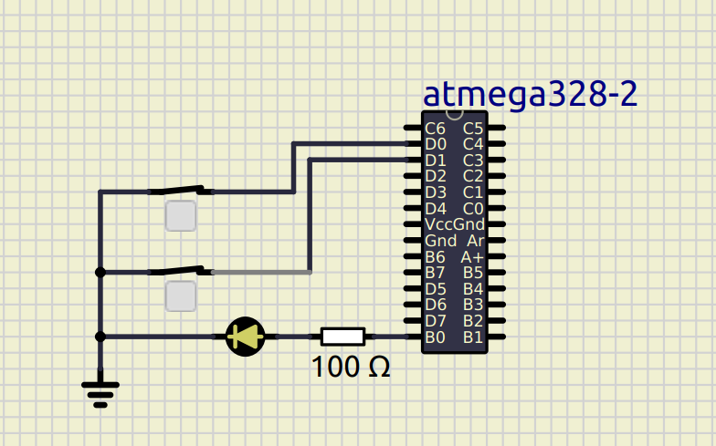
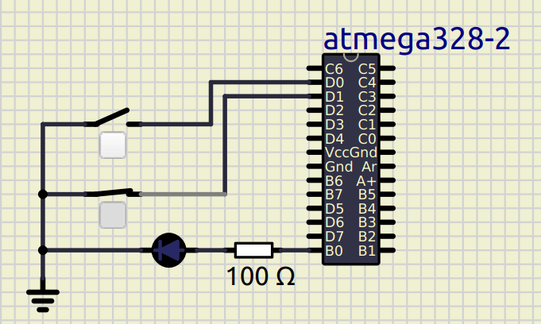

# Activty 1 with Continuous Integration and Code Quality

# Status led based on two switch inputs

## In Action

|ON|OFF|
|:--:|:--:|
|||

#### CI and Code Quality

|Build|Cppcheck|Codacy|
|:--:|:--:|:--:|
||||

## Wiki Documentation
* System [SETUP](https://github.com/nikhilvas123/atmega328-course/wiki/Software-Requirements)
