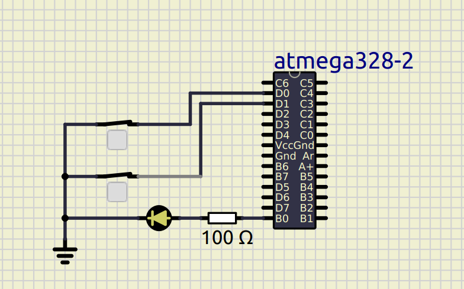
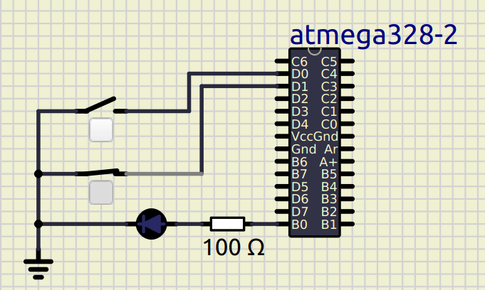
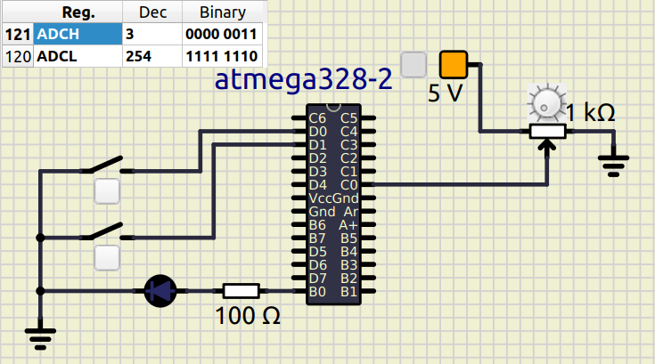
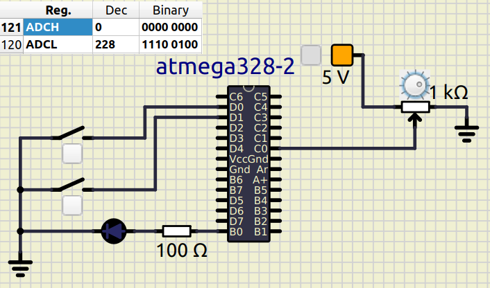
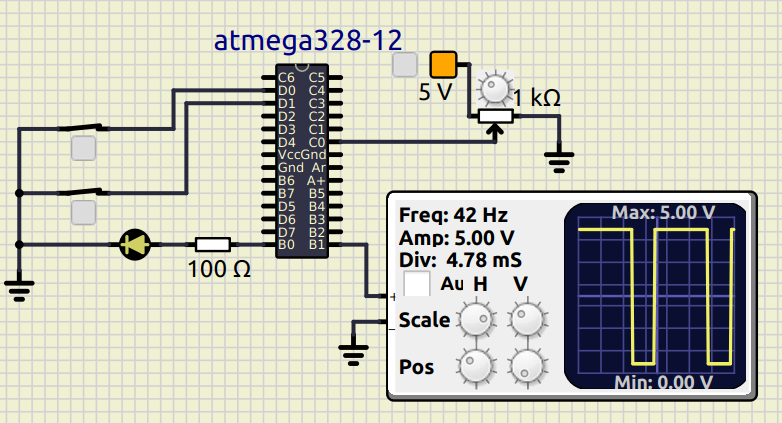
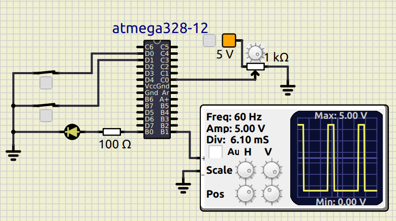

# Controlling heater element using a temperature sensor

#### CI and Code Quality
|Build|Cppcheck|Codacy|
|:--:|:--:|:--:|
||||

# Activity 1
## Controlling led using button and heater as input 
## In Action

|ON|OFF|
|:--:|:--:|
|||

# Activity 2
## Reading the temperature from sensor using ADC 

|MAX|RANDOM|
|:--:|:--:|
|||

# Activity 3
## Obtaining PWM signal based on temperature sensor

|PWM 70% duty-cycle|PWM 20% duty-cycle|
|:--:|:--:|
|||

# Activity 4
## Transmitting Temperature value through UART

|Temperature 29 C|Temperature 20 C|
|:--:|:--:|
|||

## Wiki Documentation
* System [SETUP](https://github.com/nikhilvas123/atmega328-course/wiki/Software-Requirements)