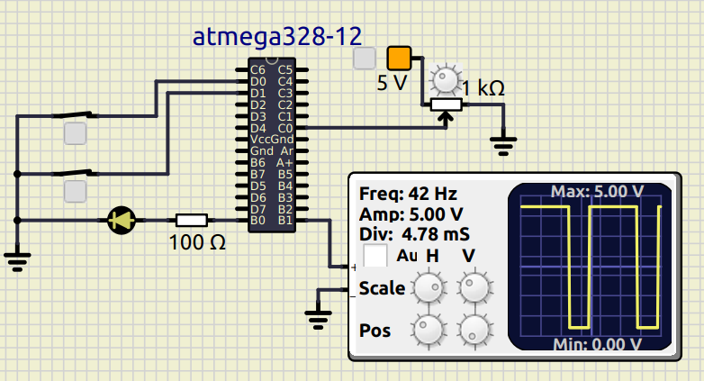
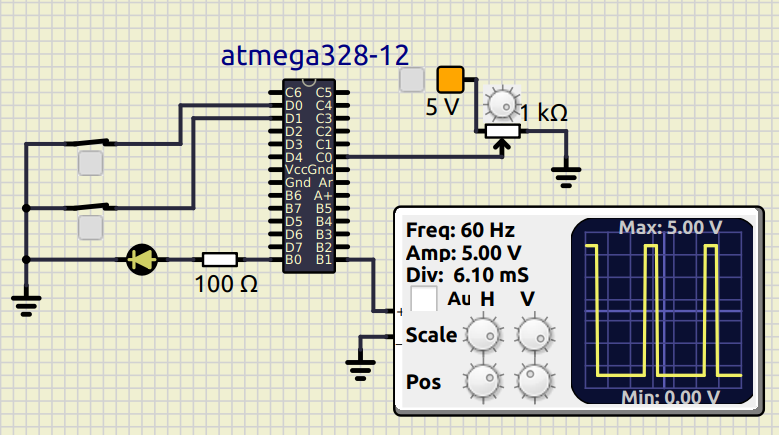

# Project In Action

## Activity 1

|ON|OFF|
|:--:|:--:|
|||

## Activity 2

|MAX|RANDOM|
|:--:|:--:|
|||

## Activity 3

|PWM 70% duty-cycle|PWM 20% duty-cycle|
|:--:|:--:|
|||

## Activity 4

|Temperature 29 C|Temperature 20 C|
|:--:|:--:|
|||